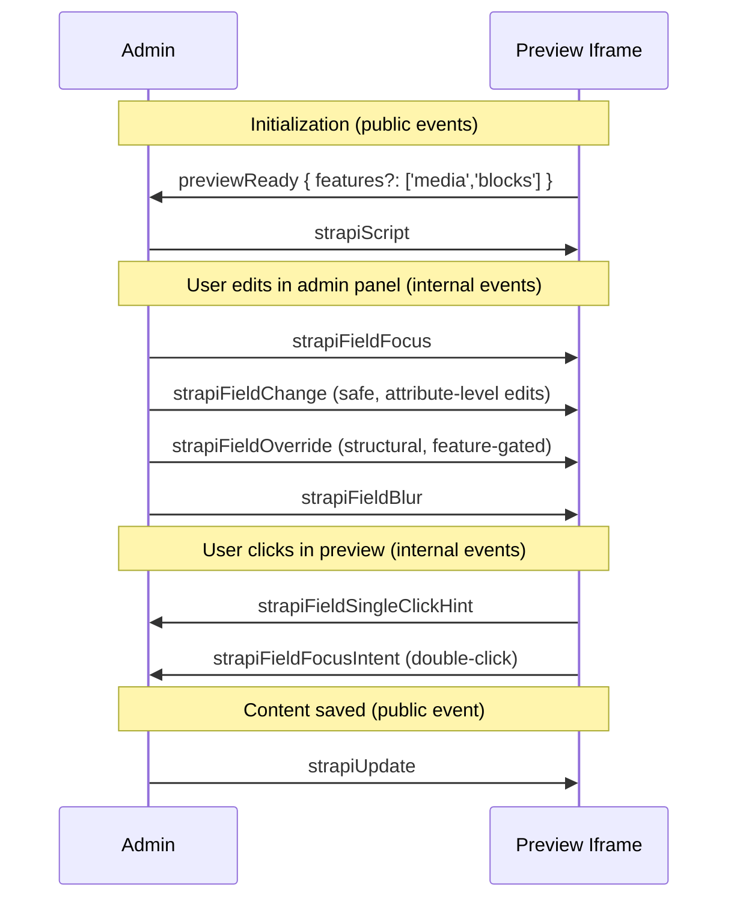

The live preview feature lets users see their content rendered on their frontend while editing. It includes visual editing that identifies and highlights editable fields.

## Why not an SDK

Visual editing requires running some of our code on the user's frontend to detect fields and draw highlights. The obvious approach would be an SDK package users install in their project. We intentionally avoided this.

An SDK would require ongoing maintenance and create version mismatch risks between the SDK and Strapi. It would also tie us to specific frameworks or require multiple framework-specific packages.

Instead, the preview script is defined inside Strapi and sent to the frontend via `postMessage`. The frontend just needs a small snippet to receive and execute it. This keeps the script always in sync with the CMS version, works with any framework, and requires no package installation.

## How the script works

### Self-contained constraint

The preview script (`packages/core/content-manager/admin/src/preview/utils/previewScript.ts`) is stringified before being sent to the iframe:

```ts
const script = `(${previewScript.toString()})(${JSON.stringify(config)})`;
```

Because of this, it **cannot import dependencies or reference external variables**. All logic must be self-contained. The only external code (`@vercel/stega` for decoding) is loaded dynamically from a CDN at runtime.

This is why the file has an unusual structure with many functions defined inline.

### Field identification with stega

We use [stega encoding](https://github.com/vercel/stega) to identify which Strapi field each piece of text comes from. Stega embeds invisible metadata into text content using Unicode zero-width characters that are imperceptible to users but can be decoded programmatically.

1. The Document Service encodes field metadata into text values (invisible to users)
2. The frontend renders the content normally
3. The preview script decodes the metadata and attaches `data-strapi-source` attributes to DOM elements
4. Highlights are drawn over elements with source attributes

The metadata uses URL search params format, because it makes it easy to encode and decode multiple pieces of information into a single string: `path=title&type=string&documentId=abc123&locale=en&model=api::page.page`

### Stega limitations

Stega can only encode strings. This means:

- **Numbers and booleans aren't encoded** — we can't modify their type in the response.
- **Fields inside components and dynamic zones work** — we encode individual string fields within them, not the parent object. The path includes indices (e.g., `components.2.title`) to identify the exact field.
- **Media URLs get a dedicated stega payload** — when traversal descends into a media object, only `url` is encoded (with `type=media`). Other string properties on the media object (`mime`, `alternativeText`, `caption`, …) are left clean so they don't pollute rendered text.
- **Block text leaves get their own encoding** — each `text` leaf in a blocks tree carries a stega payload whose `path` has full specificity (e.g. `body.0.children.0.text`) and whose `fieldPath` points at the ancestor blocks field (e.g. `body`). Click-to-focus uses `fieldPath` to open the blocks editor for the ancestor rather than an input that doesn't exist for the leaf.

### Communication protocol

The admin panel and preview iframe communicate via `postMessage`.



Public events (`previewReady`, `strapiScript`, `strapiUpdate`) are documented to users—changing them is a breaking change.

Internal events (for field focus/blur/change synchronization) are defined in `packages/core/content-manager/admin/src/preview/utils/constants.ts` and can be changed freely since we control both ends.

## Live preview integration

Stega alone covers the cases where the admin can patch the rendered DOM in place — typing in a string, typing inside a block text leaf, or swapping one image for another of the same MIME category. Structural edits (cross-type media, multi-value changes, block add / remove / reorder) can't be patched safely without re-rendering; the admin routes them as `strapiFieldOverride` messages that a consumer merges into its render state.

### Quickstart

Three steps to live-preview structural edits:

```js
// 1. Advertise which structural features your frontend is ready to handle.
//    Leave it out to keep the v1 behavior: structural edits won't update live
//    until save + reload.
window.parent.postMessage({ type: 'previewReady', features: ['media', 'blocks'] }, '*');

// 2. Inside the `strapiScript` handler, after you've injected and run the
//    script, seed `window.strapiPreview` with the current loader data and
//    subscribe to merged updates.
window.strapiPreview.setInitialData(loaderData);
const unsubscribe = window.strapiPreview.subscribe(setState);

// 3. When `strapiUpdate` triggers a revalidation and fresh data lands, call
//    setInitialData again — saved values overwrite any in-flight overrides.
```

The canonical reference implementation lives in
`examples/getstarted/src/admin/preview/dummy-preview.jsx`.

### Hybrid routing

Every field edit in the admin is routed to exactly one of two channels:

- **`strapiFieldChange` (mechanism 1)** — the injected preview script patches the iframe DOM directly. No consumer-side work needed. Used for:
  - Any string, number, boolean, date, enum, etc.
  - Media swap where both sides share a MIME category (e.g. `image/png` → `image/jpeg`).
  - Blocks edits where the tree shape is unchanged — only leaf `text` differs.
- **`strapiFieldOverride` (mechanism 2)** — the admin posts the new value at its field path. `window.strapiPreview` splices it into the override map and notifies subscribers. Used for:
  - Cross-type media swap, media clear, multi-value media edits — only when `features` includes `'media'`.
  - Block add / remove / reorder, leaf mark changes — only when `features` includes `'blocks'`.
- **No-op** — structural edits where the relevant feature wasn't advertised are dropped. That matches v1 behavior (no live preview until save).

The decision is driven by two pure diff helpers in `packages/core/content-manager/admin/src/preview/utils/routing.ts`. These are the single source of truth and the natural unit-test target.

### `features` on `previewReady`

`features` is an opt-in array. Entries today:

- `'media'` — opt in to structural media overrides.
- `'blocks'` — opt in to structural blocks overrides.

More may land (e.g. `'document'`, `'ssr-refresh'`) without a breaking change to the handshake: the admin only acts on entries it knows. A consumer that advertises `['media', 'blocks', 'document']` against an older Strapi simply keeps live preview on the features the running version understands.

### `window.strapiPreview`

Set up by the injected preview script. Two methods:

```ts
interface StrapiPreview<T = unknown> {
  // Replace the merge base. Also clears any pending overrides so saved
  // values win after a revalidation.
  setInitialData(data: T): void;

  // Register a listener. Fires immediately with the current merged state.
  // Returns an unsubscribe function.
  subscribe(listener: (merged: T) => void): () => void;
}
```

The store is shape-agnostic — it splices whatever `strapiFieldOverride.value` carries (file object, array, blocks tree, `null`) at the given path. Numeric path segments (`gallery.0`) land at the right array index.

No new npm package is introduced. The API is whatever the running Strapi version exposes; version drift between Strapi and the consumer's frontend is not a concern.

### Click-to-focus parity for unsaved content

The admin stega-encodes outgoing `strapiFieldOverride` payloads so that a newly picked image or just-typed block leaf resolves to the same admin input on double-click as saved content does — without waiting for a save. The encoding mirrors the server-side `packages/core/core/src/services/content-source-maps.ts`:

- Media override `url`s carry a `type=media` payload.
- Block text leaves carry a `type=blocks` payload whose `path` has full specificity and whose `fieldPath` points at the ancestor blocks field (so the popover opens the blocks editor, not a non-existent leaf input).

### Frontend configuration

Users can configure the preview behavior from their frontend via `window` globals, without modifying Strapi:

- `window.STRAPI_DISABLE_STEGA_DECODING` - disable field detection entirely. When true, users need to write the `data-strapi-source` attribute manually for fields to be editable
- `window.STRAPI_HIGHLIGHT_HOVER_COLOR` - customize hover highlight color
- `window.STRAPI_HIGHLIGHT_ACTIVE_COLOR` - customize active highlight color
